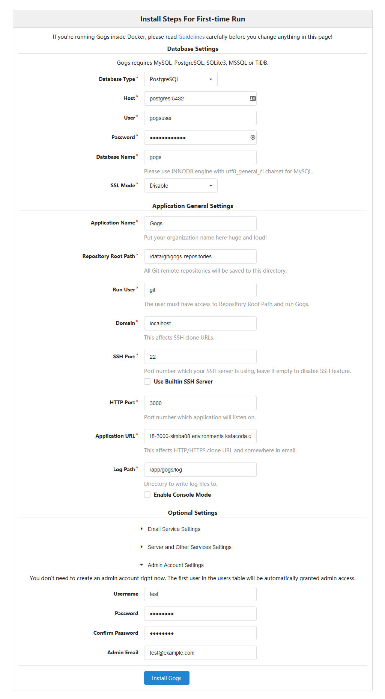

# GUI it!
There are multiple frontends that can be used in order to avoid having to deal with SSHing into the server to create repositories. Some of the most popular options that offer support for self-hosting are GitLab, Gitea and Gogs. For this tutorial we will use Gogs to create a front-end for our Git-server

Gogs provides a docker image for installation, which makes the process simple. However, it does need a database to store information in. Let's therefore create a `docker-compose` file that combines a PostgreSQL image and the Gogs image.

Copy the following into the file `docker-compose.yml` in the editor:

```yml
version: '2'

services:
  postgres:
    image: postgres:9.5
    restart: always
    environment:
     - "POSTGRES_USER=gogsuser"
     - "POSTGRES_PASSWORD=gogspassword"
     - "POSTGRES_DB=gogs"
    volumes:
     - "db-data:/var/lib/postgresql/data"
  gogs:
    image: gogs/gogs:latest
    restart: always
    ports:
     - "10022:22"
     - "3000:3000"
    links:
     - postgres
    environment:
     - "RUN_CROND=true"
    volumes:
     - "gogs-data:/data"
    depends_on:
     - postgres

volumes:
    db-data:
      driver: local
    gogs-data:
      driver: local
```{{copy}}

This file will run the Gogs frontend on port `3000`, and allow SSH access through port `10022`. 

Run the server by executing:
`docker-compose up -d`{{execute T1}}

After a few moments, the Gogs configuration screen should be visible at
https://[[HOST_SUBDOMAIN]]-3000-[[KATACODA_HOST]].environments.katacoda.com

## Configuring Gogs
In the configuration screen, there are a few settings that we have to change. 
These are:
- DB type: Postgres
- DB host: `postgres:5432`{{copy}} 
- User: `gogsuser`{{copy}} (defined in the YAML file under `services.postgres.environment`)
- Password: `gogspassword`{{copy}} (defined in the YAML file under `services.postgres.environment`)
- Application URL: `https://[[HOST_SUBDOMAIN]]-3000-[[KATACODA_HOST]].environments.katacoda.com`{{copy}}

We should also create an admin account under *Optional > Admin Account Settings*:
- User: `test`{{copy}}
- Password: `password`{{copy}}
- Email: `test@example.com`{{copy}}



Click install, and you are done with configuring your Git server!

## Using Gogs
We can now create new repositories, review pull requests, register new users and use Gogs the same way that we would use GitHub. Cloning through HTTPS works as per usual, and cloning through SSH is also possible by adding your public RSA key and using SSH to the port 10022, as defined in `docker-compose.yml`. 

The functionality mostly mirrors that of GitHub, and makes Gogs an easy self-hosted replacement. You're ready to break free of GitHub's hosting now, and embrace the true power of open source software!